<h1 align="center">🖥️ proxmox-dc-lab</h1>

<p align="center">
  Lab completo de infraestrutura local com Controlador de Domínio, DNS autoritativo redundante e roteamento por VLANs — tudo virtualizado no Proxmox VE.
</p>

<p align="center">
  
  
  
  
  
  
</p>

---

## 📌 Sobre o Projeto

Este repositório documenta a construção de um **laboratório de infraestrutura de datacenter local**, com foco em:

- **Controlador de Domínio** (AD/LDAP) com Zentyal Server
- **DNS autoritativo + redundância** (NS1/NS2 + Technitium como forwarder)
- **Segmentação de rede via VLANs** gerenciadas pelo MikroTik CHR
- **Virtualização completa** no Proxmox VE com VMs e LXC containers

O objetivo é simular um ambiente de produção real para estudo, homelab e validação de infraestrutura on-premise, com todas as decisões técnicas documentadas passo a passo.

---

## 🗺️ Topologia da Rede

```mermaid
flowchart TD

    %% ══════════════════════════════════════════
    %% ZONA: UPLINK / WAN
    %% ══════════════════════════════════════════
    subgraph UPLINK ["🌐 UPLINK / WAN"]
        INTERNET(["Internet"])
        R1["R1 · RB750Gr3\nAS 64511 · 10.80.80.1"]
    end

    %% ══════════════════════════════════════════
    %% ZONA: CHR R2 — CORE
    %% ══════════════════════════════════════════
    subgraph CHR ["🖥️ MikroTik CHR R2 — RouterOS 7.20.2  |  AS 64512  |  lo 10.90.90.2"]
        direction TB
        BRIDGE["bridge-main\nvlan-filtering=yes · RSTP · pvid=801"]
        ETH1["ether1-UPSTREAM-RB750\nVLAN 800 tagged"]
        ETH2["ether2-VM-TRUNK"]
        ETH3["ether3-VM-TRUNK"]
        ETH4["ether4-VM-TRUNK"]
        ETH6["ether6-UPSTREAM-ether5"]
    end

    %% ══════════════════════════════════════════
    %% ZONA: VPN PRIVADA — WireGuard mascarado
    %% ══════════════════════════════════════════
    subgraph VPN_ZONE ["🔒 VPN Privada — Túnel Criptografado  |  PCC Load Balance por conexão"]
        WG606["VPN-PEER-A\nWireGuard · :46993\nTabela de rota: to-wg-606"]
        WG607["VPN-PEER-B\nWireGuard · :46994\nTabela de rota: to-wg-607"]
        VPN_EXIT(["VPN Exit Node\nUDP :51820\nMSS clamp: 1380"])
    end

    %% ══════════════════════════════════════════
    %% ZONA: VLAN 410 — SERVERS
    %% ══════════════════════════════════════════
    subgraph V410_ZONE ["⚙️ VLAN 410 — SERVERS  |  10.41.10.0/24  |  GW 10.41.10.1"]
        direction TB

        subgraph DNS_ZONE ["🧩 DNS / Directory Services"]
            ZENTYAL["VM: DC1 / NS1 — Zentyal Server\nAD · LDAP · Kerberos · DNS · NTP\n10.41.10.10/24\nhostname: ns.servidor.lan"]
            NS2["VM: NS2 — Technitium DNS\nDNS Secundário · Zona Slave\n10.41.10.11/24\nhostname: ns1.servidor.lan"]
            TECH_DNS["LXC: Technitium DNS\nDNS primário da rede · Forwarder · Cache\n10.41.10.2/24\nhostname: ns2.servidor.lan"]
        end

        subgraph MON_ZONE ["📊 Monitoring Stack (Containers)"]
            PROM["Prometheus\n10.41.10.130 · :9090\n/disk1/prometheus"]
            GRAF["Grafana\n10.41.10.130 · :3000\n/disk1/grafana"]
            SNMPEXP["SNMP Exporter\n10.41.10.130 · :9116\n/disk1/snmp-exporter"]
        end

        subgraph AUTH_ZONE ["🔑 Autenticação / NAC"]
            RADIUS_C["RADIUS / PacketFence\n10.41.10.120 · :1812 UDP"]
            ADGUARD["AdGuard DNS Forwarder\n10.41.10.130 · :53"]
        end
    end

    %% ══════════════════════════════════════════
    %% ZONA: VLANs DE WORKLOAD
    %% ══════════════════════════════════════════
    subgraph VLANS_APP ["📦 VLANs de Workload"]
        V420["VLAN 420 · DEV\n10.42.20.0/24 · GW .20.1\nDHCP .10–.200 · DNS: 10.41.10.130"]
        V430["VLAN 430 · TEST\n10.43.30.0/24 · GW .30.1\nDHCP .10–.200 · DNS: 10.41.10.130"]
        V440["VLAN 440 · PROD\n10.44.40.0/24 · GW .40.1\nDHCP .10–.200 · DNS: 10.41.10.130"]
        V450["VLAN 450 · VPN-ROUTING\n10.45.0.0/24 · GW .0.1\nDHCP .10–.254 · egress → VPN-PEER-A/B"]
        V460["VLAN 460 · GUEST WiFi\n10.46.0.0/24 · GW .0.1\n⚠️ disabled"]
    end

    %% ══════════════════════════════════════════
    %% ZONA: COSMOS NODES — VLAN 440 PROD
    %% ══════════════════════════════════════════
    subgraph COSMOS_ZONE ["⛓️ Cosmos Nodes — VLAN 440 PROD"]
        VALIDATOR["Validator Node\n10.44.40.199\np2p: 26656/tcp\nDHCP static lease"]
        SENTRY1["Sentry Node 1\n10.44.40.198\np2p: 26656/tcp\nDHCP static lease"]
        SENTRY2["Sentry Node 2\n10.44.40.197\np2p: 26656/tcp\nDHCP static lease"]
    end

    %% ══════════════════════════════════════════
    %% ZONA: NAC — PacketFence Inline
    %% ══════════════════════════════════════════
    subgraph NAC_ZONE ["🛡️ NAC — PacketFence Inline"]
        V470["VLAN 470 · NAC-MGMT\n10.47.0.0/24 · GW .0.1\nDHCP .10–.200 (lease 12h)"]
        V471["VLAN 471 · NAC-REG\n10.47.1.0/24\n⚠️ DHCP disabled\nInline GW: 10.47.1.130"]
        V472["VLAN 472 · NAC-INET\n10.47.2.0/24 · GW .2.1\nDHCP .10–.200 (1h)"]
        V473["VLAN 473 · NAC-LOCAL\n10.47.3.0/24\n⚠️ DHCP disabled\nInline GW: 10.47.3.130"]
        PF["PacketFence\nInline GW: 10.47.1.130 / 10.47.3.130\nRADIUS → 10.41.10.120:1812"]
    end

    %% ══════════════════════════════════════════
    %% CONEXÕES
    %% ══════════════════════════════════════════

    INTERNET -->|"eBGP AS64511↔64512\n10.80.80.0/30"| R1
    R1 -->|"VLAN 800 · ether1→ether6\n10.80.80.2/30"| ETH1

    ETH1 & ETH2 & ETH3 & ETH4 & ETH6 --- BRIDGE

    BRIDGE -->|"VLAN 410 · ether2/3/4 tagged"| V410_ZONE
    BRIDGE -->|"VLAN 420 · ether2/3/4 tagged"| V420
    BRIDGE -->|"VLAN 430 · ether2/3/4 tagged"| V430
    BRIDGE -->|"VLAN 440 · ether2/3/4 tagged"| V440
    BRIDGE -->|"VLAN 450 · ether2/3/4 tagged"| V450
    BRIDGE -.->|"VLAN 460 · untagged ether5\n⚠️ disabled"| V460
    BRIDGE -->|"VLANs 470–473 · ether2/3/4+ether6"| NAC_ZONE

    V450 -->|"PCC mark-routing\nto-wg-606"| WG606
    V450 -.->|"PCC mark-routing\nto-wg-607"| WG607
    WG606 & WG607 -->|"UDP :51820 + NAT masquerade"| VPN_EXIT
    VPN_EXIT -->|"saída encriptada"| INTERNET

    V440 --- COSMOS_ZONE
    SENTRY1 & SENTRY2 <-->|"p2p 26656/tcp"| VALIDATOR
    SENTRY1 & SENTRY2 -->|"p2p 26656 · inbound WAN\nfirewall: cosmos-sentries"| INTERNET

    V471 -->|"inline GW"| PF
    V473 -->|"inline GW"| PF
    PF -->|"RADIUS auth"| RADIUS_C

    PROM -->|"scrape SNMP"| SNMPEXP
    GRAF -->|"datasource :9090"| PROM

    ZENTYAL <-->|"AD sync / Zona Slave"| NS2
    ZENTYAL <-->|"Zone Forward"| TECH_DNS
    TECH_DNS & NS2 -->|"upstream forwarder"| ADGUARD
```



---

## ⚙️ Ambiente de Referência

| Componente         | Detalhe                                             |
|--------------------|-----------------------------------------------------|
| **Hypervisor**     | Proxmox VE 8.4.14 (kernel 6.8.12-17-pve)           |
| **CPU Host**       | 2× Intel Xeon E5-2670 v3 @ 2.30GHz (24 threads)    |
| **Roteador**       | MikroTik CHR — RouterOS 7.20.2 (VM 102)             |
| **VLAN Servidores**| VLAN 410 — `10.41.10.0/24`                          |
| **Bridge Proxmox** | `vmbr2` → MikroTik `ether2-VM-TRUNK`               |
| **Domínio local**  | `servidor.lan`                                      |
| **DC1 / NS1**      | `10.41.10.10` — `ns.servidor.lan` / `ns1.servidor.lan` |
| **NS2 (slave)**    | `10.41.10.11` — `ns2.servidor.lan`                 |
| **Technitium DNS** | `10.41.10.2` — DNS primário DHCP da rede            |

---

## 🧩 Stack de Tecnologias

| Camada            | Tecnologia                            | Função                                |
|-------------------|---------------------------------------|---------------------------------------|
| **Hypervisor**    | Proxmox VE 8.4                        | Virtualização de VMs e LXC containers |
| **Roteamento**    | MikroTik CHR (RouterOS 7.20)          | VLANs, DHCP, firewall, NAT            |
| **AD / LDAP**     | Zentyal Server 8.x                    | Controlador de domínio primário (DC1) |
| **DNS Primário**  | Technitium DNS (LXC)                  | Forwarder, bloqueio de ads, cache     |
| **DNS Redundante**| Technitium DNS (VM NS2)               | Zona slave do `servidor.lan`          |
| **OS Base**       | Ubuntu Server 22.04 LTS               | Base das VMs                          |
| **Protocolo AD**  | Kerberos 5 + LDAP v3                  | Autenticação e diretório              |
| **NTP**           | ntpd via Zentyal                      | Sincronização de horário do domínio   |

---

## 📋 Índice da Documentação

Toda a configuração está documentada em etapas independentes dentro de `/docs`:

| # | Arquivo | Conteúdo |
|---|---------|----------|
| 01 | [Visão Geral da Arquitetura](docs/01-arquitetura.md) | Decisões de design, objetivos e componentes |
| 02 | [Mapa de Rede e VLANs](docs/02-rede-vlans.md) | Tabela de VLANs, CIDRs e segmentação |
| 03 | [Criação das VMs na Proxmox](docs/03-proxmox-vms.md) | Specs das VMs, disco, RAM, CPU, rede |
| 04 | [Instalação do Zentyal (DC1)](docs/04-zentyal-instalacao.md) | ISO, particionamento, módulos instalados |
| 05 | [DNS + Domínio Local](docs/05-dns-dominio.md) | Zonas DNS, registros A/PTR, servidor.lan |
| 06 | [LDAP / Active Directory](docs/06-ldap-ad.md) | OU, usuários, grupos, GPOs básicas |
| 07 | [NS2 — DNS Secundário Redundante](docs/07-ns2-redundancia.md) | AXFR, zona slave, failover de resolução |
| 08 | [Technitium DNS](docs/08-technitium.md) | Instalação LXC, forwarders, zone forward |
| 09 | [Ajustes no MikroTik CHR](docs/09-mikrotik-ajustes.md) | VLAN 410, DHCP server, DNS apontamento |
| 10 | [Ingressar Windows no Domínio](docs/10-windows-join-domain.md) | Join domain, GPO aplicada, validação |
| 11 | [Verificação e Testes](docs/11-verificacao-testes.md) | nslookup, dig, kinit, LDAP queries, ping |

---

## 🚀 Como Usar Este Repositório

Este projeto **não é um script automatizado** — é uma documentação técnica step-by-step. Para replicar o ambiente:

### 📋 Pré-requisitos

- Proxmox VE 8.x instalado (bare metal ou nested)
- MikroTik CHR como VM no Proxmox (ou hardware físico)
- Acesso à ISO do Zentyal Server 8.x
- Mínimo recomendado de hardware:
  - 32 GB RAM
  - 4 cores físicos (8+ threads)
  - 500 GB de armazenamento (SSD recomendado)

### 🔧 Ordem de Execução

Siga os documentos na ordem numérica:

```bash
# 1. Leia o planejamento antes de começar
docs/01-arquitetura.md

# 2. Configure as VLANs no MikroTik
docs/02-rede-vlans.md
docs/09-mikrotik-ajustes.md

# 3. Crie as VMs no Proxmox
docs/03-proxmox-vms.md

# 4. Instale e configure o DC1 (Zentyal)
docs/04-zentyal-instalacao.md
docs/05-dns-dominio.md
docs/06-ldap-ad.md

# 5. Configure redundância DNS
docs/07-ns2-redundancia.md
docs/08-technitium.md

# 6. Ingresse clientes Windows
docs/10-windows-join-domain.md

# 7. Valide o ambiente completo
docs/11-verificacao-testes.md
```

---

## 🔐 Segurança e Boas Práticas

- **Segmentação por VLANs**: tráfego de servidores isolado em VLAN 410
- **Kerberos** para autenticação de domínio (sem NTLM legado)
- **DNS redundante**: dois resolvers independentes evitam single point of failure
- **NTP via Zentyal**: sincronização de horário crítica para Kerberos (tolerância: ±5 min)
- **Zona PTR configurada**: registros reversos `/24` garantem resolução inversa

> ⚠️ **Atenção**: este é um ambiente de **laboratório**. Para produção, adicione:
> - Segundo DC para replicação AD/Kerberos
> - Backup automatizado do Proxmox (PBS)
> - Firewall por VLAN com regras explícitas de saída

---

## 📁 Estrutura do Repositório

```
proxmox-dc-lab/
├── README.md                   # Este arquivo
├── configs/                    # Arquivos de configuração exportados
│   └── ...
└── docs/                       # Documentação step-by-step
    ├── 01-arquitetura.md
    ├── 02-rede-vlans.md
    ├── 03-proxmox-vms.md
    ├── 04-zentyal-instalacao.md
    ├── 05-dns-dominio.md
    ├── 06-ldap-ad.md
    ├── 07-ns2-redundancia.md
    ├── 08-technitium.md
    ├── 09-mikrotik-ajustes.md
    ├── 10-windows-join-domain.md
    └── 11-verificacao-testes.md
```

---

## 🧪 Testes de Validação

Após seguir toda a documentação, o ambiente deve passar nos seguintes testes:

```bash
# Resolução direta
nslookup ns.servidor.lan 10.41.10.10

# Resolução reversa
dig -x 10.41.10.10 @10.41.10.10

# Autenticação Kerberos
kinit administrator@SERVIDOR.LAN
klist

# Query LDAP
ldapsearch -H ldap://10.41.10.10 -b "dc=servidor,dc=lan" -x

# Redundância DNS (com DC1 offline)
nslookup ns.servidor.lan 10.41.10.11
```

Todos os testes esperados e saídas de referência estão em [`docs/11-verificacao-testes.md`](docs/11-verificacao-testes.md).

---

## 🤝 Contribuindo

Contribuições são bem-vindas! Para reportar erros de configuração ou sugerir melhorias na documentação:

1. Abra uma [Issue](https://github.com/luanscps/proxmox-dc-lab/issues) descrevendo o problema ou sugestão
2. Faça um fork e crie uma branch: `git checkout -b fix/descricao-do-ajuste`
3. Abra um Pull Request com a correção

---

## 📄 Licença

Distribuído sob a licença **MIT**. Veja [`LICENSE`](LICENSE) para mais detalhes.

---

## ✒️ Autor

**Luan** — [@luanscps](https://github.com/luanscps)

> Desenvolvido como projeto pessoal de infraestrutura homelab / datacenter local.
